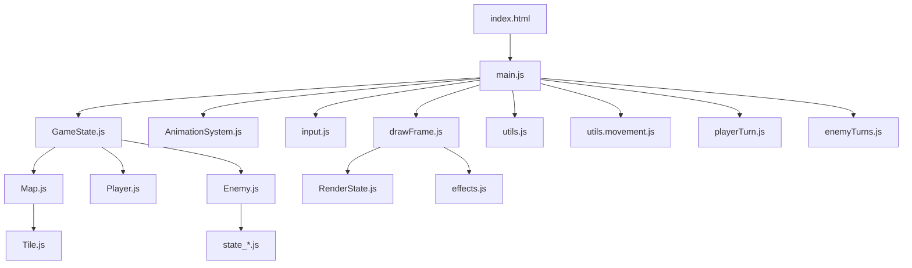

# Refactor Plan: Revised Outline

## Project Root
- `index.html` — Structures the page, loads all modules, picks up CSS.
- `style.css` — CSS styles.
- `main.js` — Starts the game loop, initializes game state, animation system, event listeners, and handles end-of-game logic.

---

## config/
- `game.js` — Core player, AI, map, and other variables that impact game state and the game loop.
- `styles.js` — Visual constants like colors, drawing sizes, shapes, etc.
- `animation.js` — Animation timing constants.

---

## game_objects/
- `GameState.js` — Defines the GameState class, which holds the overall state of the game.
- `Unit.js` — Parent class for Player and Enemy; holds shared properties and methods (e.g., move, shoot, look).
- `Player.js` — Extends Unit with player-specific properties and methods.
- `Enemy.js` — Extends Unit; each Enemy is an object with its own state and an `evaluate()` method (FSM logic).
- `Map.js` — Map class; contains a grid of Tile objects, handles map generation and threat map logic.
- `Tile.js` — Tile class; properties include type, passable, occupiedBy, inStorm, and optionally a pickup.

---

## game/
- `utils.js` — General helpers, including logging.
- `utils.movement.js` — Pure logic for movement, pathfinding, line of sight, etc.
- `playerTurn.js` — Handles player input and actions (move, attack, heal, etc.).
- `enemyTurns.js` — Loops through enemies and processes each enemy's turn.

---

## ai/
- `state_*.js` — AI state logic modules.
- (FSM logic is now part of Enemy objects via their `evaluate()` method.)

---

## ui/
- `input.js` — Handles user input.
- `ui.js` — UI rendering and updates.

---

## graphics/
- `AnimationSystem.js` — Animation system class, with start/stop methods.
- `RenderState.js` — Function that takes gameState and returns renderState.
- `drawFrame.js` — Functions for drawing the frame (drawMap, drawThreats, drawUnits, etc.).
- `effects.js` — Contains effects triggers (e.g., movement, knockback).

---

## tests/
- (To be revisited after refactor.)

---

## project/
- `README.md` — Project overview, architecture, and contributing guidelines.

---

## Mermaid Diagram: High-Level Structure

---

**Key Points:**
- All game objects (Player, Enemy) are now classes with clear responsibilities.
- The map is a grid of Tile objects, each of which can have a pickup property.
- Enemy AI logic is encapsulated in each Enemy object via an `evaluate()` method.
- No TurnManager or GameObject base class unless future needs arise.
- Sprites/assets and testing will be addressed later.
- README will document the architecture and usage.
